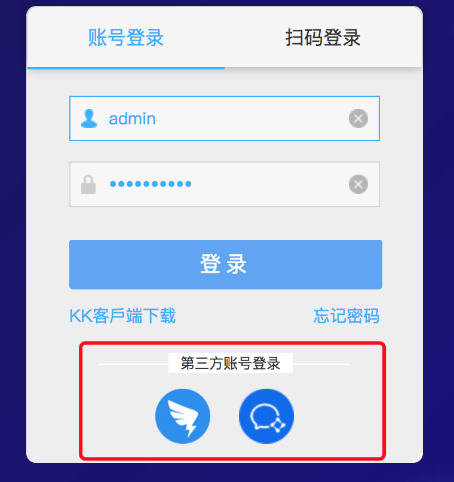
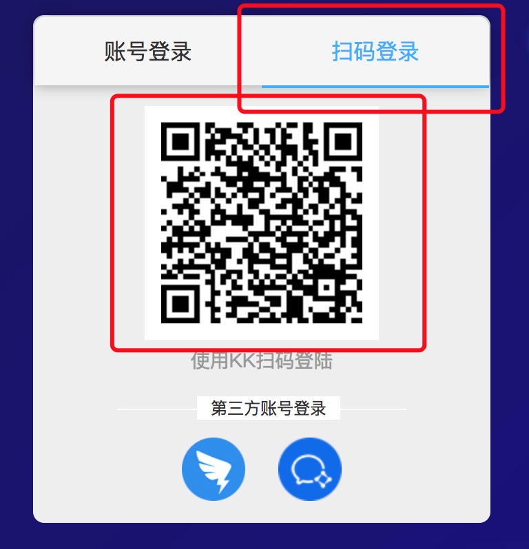

## 登录页整包上传帮助文档


​
> 为了方便项目对登录页进行全定制，V14新增了登录整包上传的功能。
> 本手册主要讲解登录页上传的一些注意事项
> 第一次进行定制建议下载模板，参考模板的格式规则去改 [下载模板](/ekp/resource/login/login.zip)

### 制作登录包注意点
1. 打包方式和主题包的打包方式一致
2. 登录的文件名必须为login.jsp 
3. 登录相关的配置文件必须为login_config.jsp
4. 必须包含配置文件【config.ini】

> 配置文件config.ini中的配置项：

```
name=登陆页上传测试模板
thumb=login_thumb.jpg
id=dragonBoat
```
字段分别为显示的名字(name)、缩略图(thumb)和id 
​
**路径注意事项**
登录页模板页点击预览地址 /resource/login/dragonBoat/login.jsp
PS:dragonBoat 为位置文件的id名字
当选择当前登录页为默认后的地址为 /ekp/login.jsp
因为登录页选中后的路径都会变成/ekp/login.jsp，所以我们登录页中的路径都必须采用**绝对路径**
​
**建议在jsp里定义一个变量**
```
示例中的id为 dragonBoat
<c:set var="templatePath" value="${LUI_ContextPath}/resource/login/dragonBoat/"/>
```
**JSP中使用该路径变量，而不能写相对路径**
```
 <link type="text/css" rel="stylesheet" href="${templatePath}css/login.css?s_cache=${LUI_Cache}" />
<script src="${templatePath}/js/jquery.js"></script>
<script src="${templatePath}/js/jquery.fullscreenr.js"></script>
<script src="${templatePath}/js/custom.js"></script>
```
**logo图片（从配置项 config.jsp 中获取的变量）**
```

     var templatePath = '${templatePath}';
 </script>
 /*JS中可以直接用变量 templatePath 来取绝对路径的值*/
```
### 定制功能介绍
> 上传的登录页目前是提供两块定制功能，logo和底部页脚
> 通过读写login_config.jsp里的字段来进行定制

**login_config.jsp 文件代码解析：**
```
<%-- {"custom_logo":"images/logo.png","custom_footInfo_CN":"Copyright © 2001-2018 蓝凌软件 版权所有","custom_footInfo_HK":"Copyright © 2001-2018 藍凌軟件 版權所有","custom_footInfo_JP":"Copyright © 2001-2018 靑ソフト 著作権所有","custom_footInfo_US":"Copyright © 2001-2018 Landray software"} --%>
<%@page import="java.util.Date"%>
<%@page import="com.landray.kmss.util.DateUtil"%>
<%@page import="net.sf.json.JSONObject"%>
<%@ page language="java" contentType="text/html; charset=UTF-8" pageEncoding="UTF-8"%>
<%
	//版权信息的年份根据服务器时间自动获取
	String __year = DateUtil.convertDateToString(new Date(), "yyyy");

	JSONObject loginConfig = new JSONObject();
	loginConfig.put("custom_logo", "images/logo.png");
	loginConfig.put("custom_footInfo_CN", "Copyright © 2001-"+__year+" 蓝凌软件 版权所有");
	loginConfig.put("custom_footInfo_HK", "Copyright © 2001-"+__year+" 藍凌軟件 版權所有");
	loginConfig.put("custom_footInfo_JP", "Copyright © 2001-"+__year+" 靑ソフト 著作権所有");
	loginConfig.put("custom_footInfo_US", "Copyright © 2001-"+__year+" Landray software");
	//
	request.setAttribute("config", loginConfig);
%>
```
**1. logo上传功能 custom_logo**
这个变量是用来获取logo的路径，上传后logo的路径在最外层。注意之前几个版本的登录页的logo是用背景图的方式来写的，在本次的制作中一定要用
```
 
/* ps:${templatePath}为前文提到的一个代表路径的变量 */
```
这种方式来制作logo，否则上传无效

**2.页脚定制功能**
我们产品是支持多语言的，所以代表页脚的配置项变量名为custom_footInfo
代表语言的key值 如 `CN-中文` `HK-繁体` `JP-日文` `US-英文`
中间以“_”分隔，例如：“custom_footInfo_CN”


### 设计登录页容易遗漏的两个点
#### 1. 第三方登录
V14版本登录页第三方登录，设计登录页和制作登录页主题包的时候需要考虑这方面

**效果图：**


登录页form.jsp 相应增加的代码为：
```
<div id="third_login_form" class="third_login_form">
		<div class="third_login_header">
			<span><%=ResourceUtil.getString("login.title.scan")%></span>
		</div>
		<ul class="third_login_list">	
			<li class="third_login_item">
				<a href="https://oapi.dingtalk.com/connect/qrconnect?appid=&amp;response_type=code&amp;scope=snsapi_login&amp;state=STATE&amp;redirect_uri=http%3A%2F%2Fexp.landray.com.cn%3A8200%2Fekp%2Fthird%2Fding%2FpcScanLogin.do%3Fmethod%3Dservice" title="<%=ResourceUtil.getString("login.title.scan")%>"></a>
			</li>
			<li class="third_login_item">
				<a href="https://qy.weixin.qq.com/cgi-bin/loginpage?corp_id=wx7b6f5d246b88c3b6&amp;redirect_uri=http%3A%2F%2Fexp.landray.com.cn%3A8200%2Fekp%2Fthird%2Fwx%2FpcScanLogin.do%3Fmethod%3Dservice&amp;usertype=member" title="<%=ResourceUtil.getString("login.title.scan")%>"></a>
			</li>
		
			<li class="third_login_item">
				<a href="https://open.work.weixin.qq.com/wwopen/sso/qrConnect?appid=ww4b1bf0bff6eebd70&amp;agentid=&amp;redirect_uri=http%3A%2F%2Fexp.landray.com.cn%3A8200%2Fekp%2Fthird%2Fwxwork%2FpcScanLogin.do%3Fmethod%3Dservice&amp;state=state" title="<%=ResourceUtil.getString("login.title.scan")%>"></a>
			</li>
		
		</ul>
	</div>
```
第三方登录CSS样式参考：
```
/* 第三方登录 */
.third_login_form{padding:10px 25px;}
.third_login_header{margin-bottom: 20px;border-top: 1px solid #fff; text-align: center; position: relative;}
.third_login_header span{font-size:12px;color:#333; padding: 0 5px;width: 94px;background-color: #fff;display: inline-block; margin-top: -10px; margin-left: -47px;position: absolute;left: 50%;}
.third_login_header:after, 
.third_login_list:after {content: '';display: table;visibility: hidden;clear: both;}
.third_login_list { margin: 0;padding: 0;list-style: none;text-align: center;}
.third_login_list > li {  display: inline-block;}
.third_login_list > li > a {margin: 0 10px;width: 46px;height: 46px; display: block; border-radius: 50%;background-color: transparent;background-repeat: no-repeat;background-position: 50%;transition-duration: .3s;}
.third_login_list > li > a img{ max-width: 100%; }
```
#### 2.扫码登录
**效果图：**


登录框内头部代码新增：
```
<div class="header">
	<span class="header_tab" data-login-role="form_account">
		<%=ResourceUtil.getString("login.title.account")%>
	</span>
	<span class="header_tab selected" data-login-role="form_pcscan">
		<%=ResourceUtil.getString("login.title.scan")%>
	</span>
</div>
```
CSS参考：
```
/*  扫码登录相关  */
.login_iframe .header .header_tab{
  width: 50%;
  float: left;
  font-size:16px;
  text-align:center;
  border-bottom: 2px solid transparent;
  color: #fff;
}
.login_iframe .header .header_tab:hover{
  color: ##38adff;
  cursor: pointer;
}
.login_iframe .header .header_tab.selected{
  color: #d0fdfa;
  border-color: #d0fdfa;
  height: 40px;
}
.login_iframe .header .header_tab:first-child{
  border-top-left-radius: 8px;
}
.login_iframe .header .header_tab:nth-child(2){
  border-top-right-radius: 8px;
}
/* 二维码相关样式 */
.form_pcscan{
  display:none;
  padding: 15px 35px;
}
.form_pcscan_iframe{
  border: 0;
  width: 100%;
  height: 170px;
}
.form_pcscan_tip{
  color: #999;
  text-align: center;
}
```
登录框的头部header里的内容不要轻易改动，因为这里是可以配置成选项卡的样式，这里的样式需要做两种。一种纯文字的，一种选项卡

